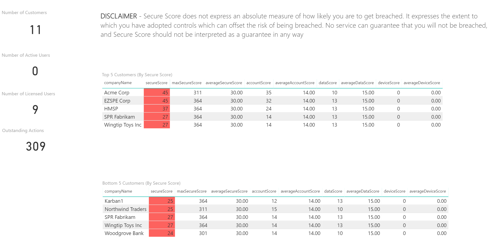
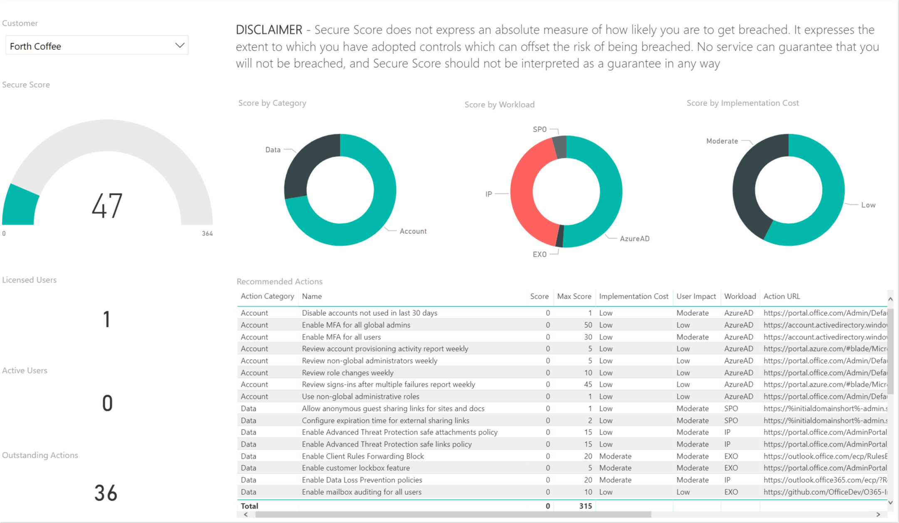

# Partner Smart Office 

## Secure Score
Secure Score is a numerical summary of a given customer’s security posture within Office 365 based on system configurations, user behavior, and other security related measurements. It represents the extent to which the customer has adopted security controls available in Office 365, which can help offset the risk of being breached. No online service is completely immune from security breaches; Secure Score should not be interpreted as a guarantee against security breach in any manner. A partner can leverage Microsoft Graph to obtain a given customer’s Secure Score. This functionality makes it possible to identify which customers have a security posture that is less than desirable. Using this information, a partner can rapidly perform a security assessment for all their customers that have Office 365 services.

