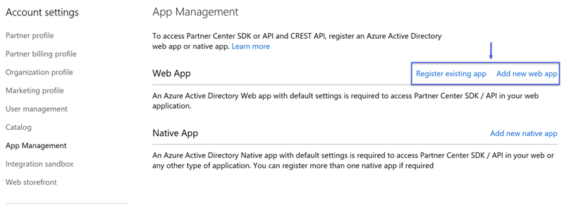
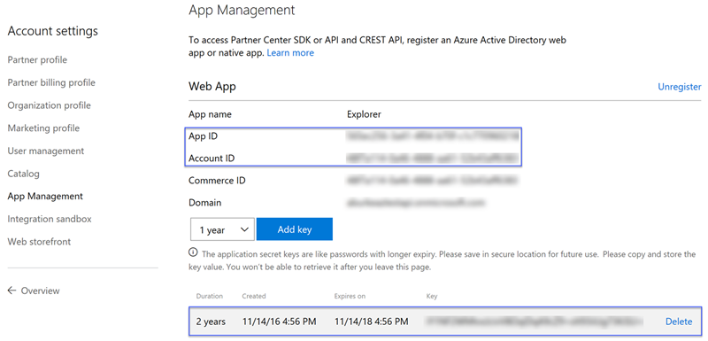

# Partner Smart Office 

Partner Smart Office is an opensource project that demonstrates how a partner can aggregate Secure Score information into a single repository for all customers. Secure Score is a numerical summary of a given customer’s security posture within Office 365 based on system configurations, user behavior, and other security-related measurements. It represents the extent to which the customer has adopted security controls available in Office 365, which can help offset the risk of being breached. No online service is completely immune from security breaches; Secure Score should not be interpreted as a guarantee against security breach in any manner. 

## Architecture

This solution utilizes an Azure Function App to request and store Secure Score information into an instance of Azure Cosmos DB. That database can be leveraged to construct detailed reports and provide insights into your customer's security posture with respect to Office 365. After deploying this project you will have an Azure Function with the following functions defined 

* __ImportSecureScoreControls__ - This function will run once a day to import the Secure Score control list entries. These entries define the various actions that can and should be taken, to improve a customer's security posture. 
* __ProcessCustomers__ - This function will enqueue each customer available in the instance of Azure Cosmos DB to a storage queue once a day. This is done to trigger the function that will import the Secure Score information for the given customer.
* __ProcessSecureScore__ - This function is triggered whenever a customer object is added to the customers queue. When it executes, it will obtain the Secure Score for the customer and write the details to the instance of Azure Cosmos DB.
* __PullCustomers__ - This function will run once a day to import customers from Partner Center. Partner's that are not a part of the Cloud Solution Provider (CSP) program can disable this function. If you disable it you will need to develop a process to add customer entries to the Customers collection found in the instance of Azure Cosmos DB. 

## Deployment

Perform the following tasks to deploy this project. If you are not a part of the CSP program then you can skip steps 3 - 6. 

1. Create and configure the Azure AD application required to access Microsoft Graph, by running the [Create-AzureADApplication.ps1](https://raw.githubusercontent.com/Microsoft/Partner-Smart-Office/master/scripts/Create-AzureADApplication.ps1) script.
2. Document the __ApplicationId__ and __AplicationSecret__ values that the script outputs. These values will be used when deploying the ARM template.
3. Login into the [Partner Center](https://partnercenter.microsoft.com) portal using credentials that have _AdminAgents_ and _Global Admin_ privileges
4. Click _Dashboard_ -> _Account Settings_ -> _App Management_ 
5. Click on the _Register existing_ app if you want to use an existing Azure AD application, or click _Add new web app_ to create a new one

    

6. Document the _App ID_ and _Account ID_ values. Also, if necessary create a key and document that value. 

    

7. Click the __Deploy to Azure__ button below to deploy this project to Azure.

